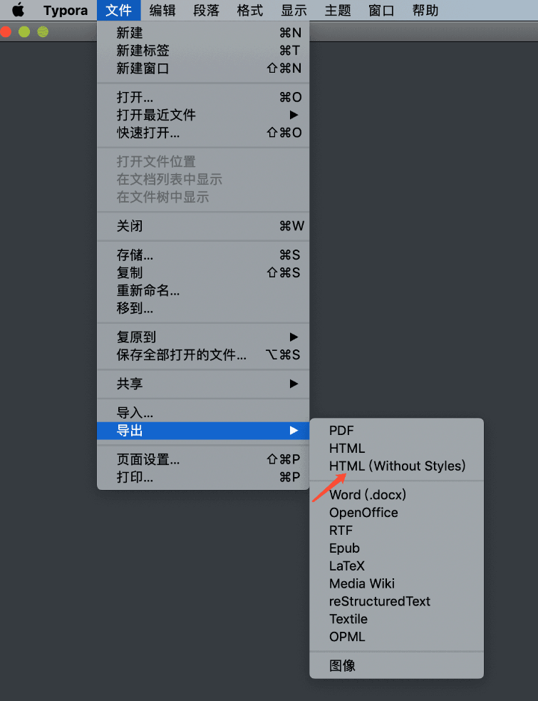

makrdown-css
=========

[](https://pypi.python.org/pypi/markdown-css)

Markdown css is a command tool to convert css style into markdown inline style.

## Theme Demo

[apollo.css](http://wecatch.me/markdown-css/themes/apollo.html)

[ocean.css](http://wecatch.me/markdown-css/themes/ocean.html)

[simple.css](http://wecatch.me/markdown-css/themes/simple.html)

[style.css](http://wecatch.me/markdown-css/themes/style.html)

[typing.css](http://wecatch.me/markdown-css/themes/typing.html)

[xiaolai.css](http://wecatch.me/markdown-css/themes/xiaolai.html)


## Install

*maxOS*

```bash
xcode-select --install
pip install markdown-css
```

**linux**

```bash
apt-get install libxml2-dev libxslt1-dev python-dev
apt-get install python-lxml
pip install markdown-css
```

## Getting started

```bash
pip install markdown-css
mkdir public
touch style.css
markdown -h
markdown-css markdown.html --style=style.css --out=public
```

### Themes

https://github.com/wecatch/markdown-css/tree/master/themes

### Demo

```
git clone https://github.com/wecatch/markdown-css.git
cd themes
markdown-css markdown.html --style=simple.css --out=public
```

## Selector

markdown-css support css selector like these:

*element selector*

```css
p {
    margin: 10px 0;
}
```


*multi element selector*

```css
h1,p,h2,pre {
    color: #333;
}
```

*all element*

```css
* {
    font-size: 14px
}
```

*pseudo-selector*

```css
h1:before {
    content: '#'
}
```

*child element seletor*

```css
blockquote p {
    color:#888;
}

```
> Pseudo-selector can't be used in inline-style, these selectos are write into \<style\> tag

## 中文介绍

markdown-css 是一个命令行工具用来为无 CSS 的 html 文档添加 CSS，渲染之后的 html 可以直接粘贴在微信公众号使用。

要使用 markdown-css ，通常你需要一款类似 typora 的编辑器，用 markdown 完成写作之后导出为不带任何 style 的 html 文档:



然后再需要提供一个主题样式，仓库里已经有了一些主题样式可以使用，用以下命令完成转换：

```shell
markdown-css markdown.html --style=style.css --out=public
```

渲染之后的文档会导出在同目录下的 public 中，用 Chrome 浏览器打开渲染之后的同名文档，复制粘贴到微信公众号编辑器即可。

> 注意: 由于微信公众号对 ul 和 ol 进行了转换，markdown-css 针对这两种标签进行了特殊处理，并且提供了 render 参数来选择是否要特殊处理 ul 和 ol，默认情况为是，可以根据自己的需要不特殊处理 ul 和 ol，只要 render 不等于 wechat 即可。